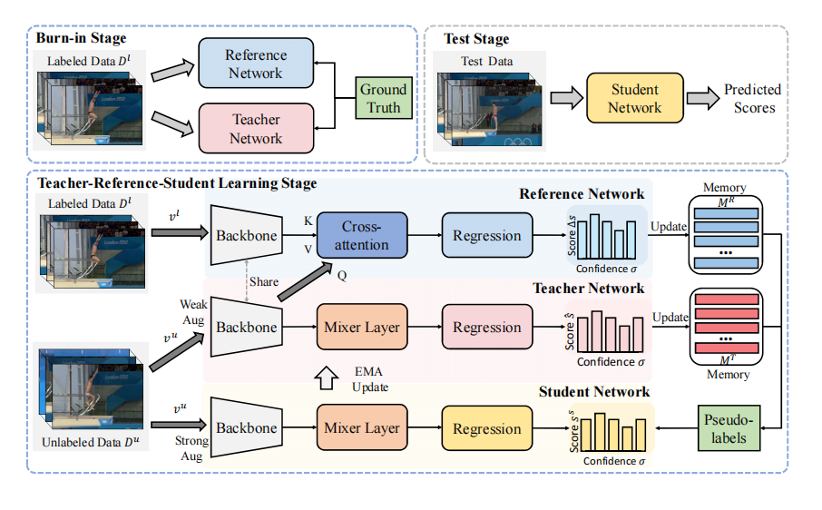
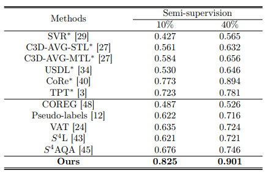

<div align="center" style="font-family: charter;">

<h1><i> Semi-Supervised Teacher-Reference-Student Architecture for Action Quality Assessment</h1>

<br />
<a href="[https://arxiv.org/abs/2412.14171](https://www.ecva.net/papers/eccv_2024/papers_ECCV/papers/09402.pdf))" target="_blank">
    
</a>
<a href=" https://github.com/wuli55555/TRS" target="_blank">
     
</a>

<div>
    <a href="#" target="_blank">Wulian Yun </a><sup></sup>,
    <a href="#" target="_blank">Mengshi Qi </a><sup></sup>,
    <a href="#" target="_blank">Fei Peng </a><sup></sup>,
    <a href="#" target="_blank">Huadong Ma </a><sup>*</sup>
</div>

<div>
    <sup> </sup> Beijing Key Laboratory of Intelligent Telecommunications Software and Multimedia
</div>

 

 
<p align="justify"><i> Existing action quality assessment (AQA) methods often require a large number of label annotations for fully supervised learning, which are laborious and expensive. In practice, the labeled data are difficult to obtain because the AQA annotation process requires domain-specific expertise. In this paper, we propose a novel semi-supervised method, which can be utilized for better assessment of the AQA task by exploiting a large amount of unlabeled data and a small portion of labeled data. Differing from the traditional teacher-student network, we propose a teacher-reference-student architecture to learn both unlabeled and labeled data, where the teacher network and the reference network are used to generate pseudo-labels for unlabeled data to supervise the student network.
 </i></p>

</div>

## Release

- `2025-05` 💾 We released our code.
- `2024-10` 🚀 Our paper accepted by ECCV 2024.

## Results
 We utilize the Spearman’s rank correlation as an evaluation metric to assess the performance of our method under different labeled data.

 
 

## Data Preparation
1. Prepare [MTL-AQA](https://github.com/ParitoshParmar/MTL-AQA) dataset.
    * Download the dataset from the link provided in [this repo](https://github.com/sujoyp/wtalc-pytorch).
3.  Download the I3D backbone pretrained on Kinetics ([this repo](https://drive.google.com/file/d/1M_4hN-beZpa-eiYCvIE7hsORjF18LEYU/view)).
2.  Unzip it under the  ```dataset/ ``` folder.

## Installation
1. Dependencies
* python == 3.8.13
* torch== 1.12.1

2. Create conda environment
    ```shell script
    conda create --name TRS python=3.8.13
    source activate TRS
    pip install -r requirements.txt
    ```

## Training 
Run the following code to start training.
```bash
python -u main.py --gpu 0 --exp 1 
```
 

## Acknowledgement
Our evaluation code is build upon [USDL](https://github.com/nzl-thu/MUSDL), [CoRe](https://github.com/yuxumin/CoRe)). We acknowledge these team for their valuable contributions to the field of action quality assessment.

## Citation
 
If you find this project useful for your research, please use the following BibTeX entry.

```
@inproceedings{yun2025semi,
  title={Semi-Supervised Teacher-Reference-Student Architecture for Action Quality Assessment},
  author={Yun, Wulian and Qi, Mengshi and Peng, Fei and Ma, Huadong},
  booktitle={European Conference on Computer Vision},
  pages={161--178},
  year={2025},
  organization={Springer}
}

```
 
